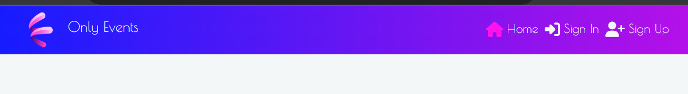
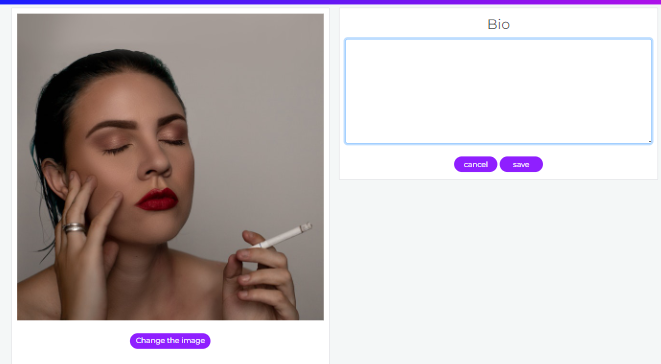
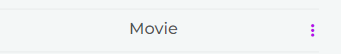

# Only Events

OnlyEvents is an events website based on a social media model. 
The purpose of the website is to acknowledge users of events, which they can filter according to their tastes.
The website also helps users socialize through a commenting section that enables them to schedule meet-ups before an event.
Users can show interest and attendance to events, comment and like others' comments, and post pictures relative to the events. 
Users can only post pictures on the event page, not on their profile page, as this is not a social media that aims to promote individuals but only events, and they can not like pictures since the purpose of the website is not to encourage or discourage to post photos in base on other users' likes.

Visit the deployed website here - <a href="https://onyevents87.herokuapp.com/" target="_blank" rel="noopener">Only Events</a>.

Visit the deployed API here - <a href="https://onlyevents-drf-api.herokuapp.com/" target="_blank" rel="noopener">Only Events</a>.

You can view the back-end README.md here - <a href="https://github.com/Martinap87/onlyevents-drf-api" target="_blank" rel="noopener">Only Events API README</a>

## Table of Contents

1. [User Experience (UX)](#user-experience-ux)
    1. [Project Goals](#project-goals)
    2. [Development process](#development-process)
    3. [Epics and user stories](#epics-and-user-storie)
       1. [User stories progress](#user-stories-progress)
    4. [Structure](#structure)
    5. [Design planning](#design-planning)
    6. [Design choices](#design-choices)
        1. [Color scheme](#color-scheme)
        2. [Typography](#typography)
2. [Features](#features)
   1. [Navbar](#navbar)
   2. [Event Page](#event-page)
      1. [Search bar](#search-bar)
      2. [Add event section](#add-event-section)
      3. [Events section](#events-section)
      4. [Most popular profiles](#most-popular-profiles)
   3. [Event Page](#event-page)
      1. [Gallery section](#gallery-section)
      2. [Event section](#event-section)
      3. [Event genre section](#event-genre-section)
      4. [Comment section](#comment-section)
      5. [Comment form section](#comment-form-section)
      6. [Going/Interested section](#goinginterested-section)
   4. [Event forms section](#event-forms-section)
      1. [Event create form](#event-create-form)
      2. [Event edit form](#event-edit-form)
   5. [Photo page](#photo-page)
   6. [Photo forms section](#photo-forms-section)
      1. [Photo create form](#photo-create-form)
      2. [Photo edit form](#photo-edit-form)
   7. [Profile Page](#profile-page)
      1. [Profile picture section](#profile-picture-section)
      2. [Edit profile button](#edit-profile-button)
      3. [Add a preference section](#add-a-preference-section)
      4. [Favorites section](#favorites-section)
      5. [Main profile section](#main-profile-section)
      6. [Profile events section](#profile-events-section)
      7. [Most popular profiles section](#most-popular-profile-section)
   8. [Edit profile details forms](#edit-profile-details-forms)
      1. [Edit profile form](#edit-profile-form)
      2. [Edit username form](#edit-username-form)
      3. [edit password form](#edit-password-form)
   9. [Photos Page](#photos-page)
   10. [Categories Page](#categories-page)
      1. [Categories list](#categories-list)
   11. [Category forms](#category-forms)
      1. [Category create form](#category-create-form)
      2. [Category edit form](#category-edit-form)
   12. [Category Page](#category-page)
      1. [Category](#category)
      2. [Genres list](#genres-list)
   13. [Genre forms](#genre-forms)
      1. [Genre create form](#genre-create-form)
      2. [Genre edit form](#genre-edit-form)
4. [Reusable components](#reusable-components)
5. [Technologies Used](#technologies-used)
    1. [Languages](#languages)
    2. [Libraries and frameworks](#libraries-and-frameworks)
    3. [NPM packages/dependencies](#npm-packages--dependencies)
    4. [Other tools](#other-tools)
6. [Testing](#testing)
    1. [Go to TESTING.md](https://github.com/martinap87/onlyevents87/blob/main/TESTING.md#onlyevents-testing)
7. [Deployment](#deployment)
   1. [Deployment to Heroku](#deployment-to-heroku)
   2. [Local deployment](#local-deployment)
8. [Credits](#credits)
9. [Media](#media)

***

## User Experience (UX)

### Project Goals

- Responsive design to make the website accessible on different screen sizes.
- The structure and layout are easy to understand and provide a positive user experience.
- The website design and colors are appealing to the users.
- Users are offered the opportunity to register an account.
- Users can create, edit, delete, and retrieve events easily.
-The events are filtered by followed users, preferences, interested, and going.
- Users can also retrieve events by date, username, or title.
- Users can show interest and intention to go to an event.
- Users can comment and like comments.
- Users can add, edit and delete photos.
- Users can add preferences to their profiles.
- The admin can add, edit, and delete categories and genres.
- Users are not allowed to perform changes to the categories and genres.

### Development process

The development process of the project has been divided into phases. The first phases aim to build the essential features for a minimal working website, and the last phases include the features that are desirable but not mandatory.

**First Phase**

- Create, edit, and delete events
- View event list
- View event page
- Search event by title, name, or date
- Create, edit, and delete comments
- View comment list

**Second Phase**

- Account registration
- Display user profile
- Edit user profile
- Follow/unfollow profiles
- Create, edit, and delete categories
- View category list
- View category page
- Create, edit, and delete genres
- View genre list
- Create, edit, and delete event genres

**Third Phase**

- Create, edit, and delete event photos
- View the event photo list
- Create and delete user preferences
- Like/Unlike comments
- Show interest/uninterest for an event
- Show going/not going to an event
- View event list filtered by preference/going/interested/following
- Responsive design
- View profiles that are going/interested in the event page

### Epics and user stories

**Epic 1 - Main events page**

- As a logged-in user, I can create events so that other users with my same interests can participate.
- As an event owner, I can edit and delete my event so that I can make corrections or update it after it was created.
- As a logged-in user, I can view the details of an event so that I can learn more about it.
- As a user, I can view the events ordered from the farthest in the future so that I can view the events in chronological order.
- As a user, I can keep scrolling through the events on the site, that are loaded for me automatically so that I don't have to click on "next page".
- As a user, I can view a navbar from every page so that I can navigate easily between pages.

**Epic 2 - Comments**

- As a logged-in user, I can add comments to an event so that I can share my thoughts about the event.
- As a logged-in user, I can read comments left by users under events so that I can read what other users think about the events.
- As a comment owner, I can edit and delete my comment so that I can make corrections after my comment was created.

**Epic 3 - Profiles**

- As a logged-in user, I can edit my profile so that I can change my profile picture, interests, and bio.
- As a logged-in user, I can update my username and password so that I can change my display name and keep my profile secure.
- As a logged-in user, I can follow and unfollow other users so that I can see and remove events by specific users in my events feed.
- As a user, I can see a list of the most followed profiles so that I can see which profiles are popular.

**Epic 4 - User account**

- As a user, I can create a new account so that I can access all the features for signed-up users.
- As a user, I can sign in to the app so that I can access functionality for logged-in users.
- As a user, I can tell if I am logged in or not by the look of the navigation bar so that I can log in if I need to.

**Epic 5 - Admin functionalities**

- As an admin, I can create categories so that other users can add a category to the event they create.
- As an admin, I can edit and delete categories so that I can make corrections or update the category after it was created.
- As an admin, I can view the categories list so that I can see which new categories I can add.
- As an admin, I can create genres so that other users can add genres to the event they create and add them to their preferences.
- As an admin, I can edit and delete genres so that I can make corrections or update the genre after it was created.
- As an admin, I can view the genres list so that I can see which new genres I can add.

**Epic 6 - Photos**

- As a logged-in user, I can post a photo of the event so that users can have an insight into the event.
- As a photo owner, I can edit or delete my photos so that I can make corrections after the photo was posted.
- As a logged-in user, I can view a photo list of the event so that I can have a better understanding of the event.

**Epic 7 - User extra functionalities**

- As a user, I can search for events with keywords so that I can find the events I am most interested in.
- As a logged-in user, I can like comments so that I can show my support and agreement with other users' opinions.
- As a logged-in user, I can be interested in an event so that I can show my interest in the events that I want to go to.
- As a logged-in user, I can be going to an event so that I can show my participation in the events.
- As a logged-in user, I can view the events list filtered by the users I follow so that I can keep up to date with the events they are posting.
- As a logged-in user, I can view the events I am interested in so that I can decide to participate.
- As a logged-in user, I can view the events I am going to so that I can have a reminder.
- As a logged-in user, I can view the events list filtered by my preferences so that I can quickly find the events I am most likely interested in.
- As a logged-in user, I can see a list of profiles that are attending and a list of profiles that are showing interest in the event so that I can see how popular is the event.

#### User stories progress

GitHub Projects was used as my project management tool to track user stories. Using a Kanban board helped me to focus on specific tasks and track the project's progress.

**Sprint 1**

**Sprint 2**

**Sprint 3**

**Sprint 4**

**Sprint 5**

**Sprint end**

### Structure
The website has been organized in a hierarchical tree structure for the user to navigate the site intuitively.

### Design planning:

The design of the website has been implemented using Balsamiq wireframes. The wireframes allowed me to sketch prototypes of the web pages so that I had a clear visual idea of how the website should have looked like.

**Home Page**

**Profile Page**

**Event Page**

**Categories Page**

**Category Page**

**Add event form**

**Add photo form**

### Design choices

#### Color scheme

Due to the versatility of the website, which can display sports events as well as yoga events, art events, or classical music events, finding the appropriate color has revealed a challenging task. The final decision was a gradient of purple tones, which according to color psychology, also represents imagination and creativity and looks quite popular amongst events websites.
The colors were taken from [Color Adobe](https://color.adobe.com/create/color-wheel), using the Analogous option.

#### Typography

The font used for the navigation bar is Poiret One: a geometric font that also appears delicate and attractive.
Across the site, the font used is Montserrat. This
typeface achieves high legibility even in small sizes and perpetrates the modern vibes of the website.
The pairing was taken from the pairing section of [Fontpair](https://www.fontpair.co/all).

## FEATURES:

### Navbar

- The fully responsive navigation bar appears on all pages;
- It displays differently for admin, logged-in, and logged-out users:
* It displays links to the Home page (through the logo and Home button), Add Event, Feeds, Favorites, Interested, Going, Sign Out, and user Profile page for logged-in users;
* For the admin, it displays an extra link to Categories;
* It displays links to the Home page (through the logo and Home button), Sign In and Sign Up forms for logged-out users.
- This section will allow the user to easily navigate from page to page across all devices without reverting to the previous page via the ‘back’ button;
- The icons change color when hovered and clicked, reflecting the current status to provide feedback for a better user experience;
- When the screen size scales down to 991px, the navbar collapses into a hamburger menu.

### Home page

#### Search bar

- It allows the user to search for an event by date, username of who posted the event, and event title;
- It displays an info icon to communicate to the users the parameters they can use to search for the events.

#### Add event section

- This section helps the user immediately detect the main functionality of the website;
- By clicking on the link, the user is sent to the Add Event form.

#### Events section

- It allows users to visualize all events and their main details;
- The user can scroll down to view all events without having to click on a next page button;
- Through this section, the user can show interest and/or attendance at an event by clicking on the relevant icon, and see if the event has been commented on;
- When the user clicks on an event, it sends them to the event page.

#### Most popular profiles

- The user can see a list of the most followed profile and access their pages by clicking on the profile image.

### Event page

#### Gallery section

- By clicking on the "see the gallery" button, the user can access the gallery and view all pictures in it;
- If the user clicks on a photo, they are redirected to the photo page;
- The user can also add a photo through this section by clicking on the "Add a photo" button;
- The Add a photo button redirects the user to the photo form.

#### Event section

- This section displays all details the user needs to attend the event, such as date, time, location, and address;
- If the user is the event owner, they can access the dropdown menu to delete or edit the event;
- If the user is the event owner, they can access the "Add genre" button, which provides a form where the user can select the most suitable option.

#### Event genre section

- It displays the genre/s of the event category, providing the user with extra information about the event;
- This section is related to user preferences: when an 
event has genres, the users that have the same genres in their preference section will have the event displayed in their Favorites;
- The event owner can delete the genres in this section. 

#### Comment section

- This section displays comments written by users, along with their usernames and how long ago the comments were posted;
- The comments are ordered by date, with the most recent at the top;
- This section allows the user easily follow the conversation;
- If the user is the comment owner, they can access the dropdown menu to delete or edit the comment;
- Users can like comments as long as they are logged in and not the comment owner.

#### Comment form section

**Create comment form**

- This section displays a form that allows the user to leave feedback;
- Through this section, the user can interact with other users;
- Once the comment is submitted, the message is displayed under the form.

**Edit comment form**

- This section enables the comment owner to edit the content of the comment;
- The previous comment is displayed in the form.

#### Going/Interested section

These sections display the number and a list of users that clicked on the going/interested button;
It provides the user with information about the popularity of the event;
From this section, the user can follow/unfollow other users and view their profiles.

### Event forms section

#### Event create form

- This section enables the user to add an event;
- When the form is not filled correctly, it displays an error message under the relevant field.
- When the user submits the form successfully, they are redirected to the event page.

#### Event edit form

- This section enables the event owner to edit the event;
- In the form all information about the event is retrieved;
- It displays an information icon that, when clicked, informs the event owner that by editing the category, it deletes all the genres previously linked to the event.
- When the form is not filled correctly, it displays an error message under the relevant field.

### Photo page

- It provides the user a wider view of the selected photo along with the title, date of upload, profile image, and username of who posted it;
- If the user is the photo owner, they can access the dropdown menu to delete or edit the event;

### Photo forms section

#### Photo create form

- This section enables the user to add a photo to an event;
- When the form is not filled correctly, it displays an error message under the relevant field.
- When the user submits the form successfully, they are redirected to the event page.

#### Photo edit form

- This section enables the photo owner to change the image and edit the photo title;
- In the form the previous photo information is retrieved;
- When the form is not filled correctly, it displays an error message under the relevant field.

### Profile page

#### Profile picture section

- It displays the profile picture of the user.

#### Edit profile button

- If the user is the profile owner, it displays a button that opens a dropdown menu to edit the password, username, or profile (bio and image).

#### Photo section

- It displays a button that links to a photos page;

#### Add a preference section

- This section displays a button that, when clicked, toggles a form;
- The form allows the user to select a preference to be then displayed in the profile.
- If the preference already exists, it displays an error.

#### Favorites section

- This section displays a list of the user's favorite genres;
- If the user is the profile owner, it shows a bin icon next to the preference so the user can delete it;
- It allows other users to know more about the profile they are currently looking;
- The user preferences determine the events they see on the Favorite page since the events are filtered according to the user's tastes.

#### Main profile section

- In this section the user can see the username of the profile, the numbers of the events posted, followers and following, and bio.

#### Profile events section
- It displays all events posted by the profile owner in the same format as the home page.

#### Most popular profile section
- Like on the home page, the user can see a list of the most followed profile and access their pages by clicking on the profile image.

### Edit profile details forms

#### Edit profile form

- It displays a form to change the image and bio so that the user can update them as they like.

#### Edit username form

- It displays a form to edit the username;
- If the changed name is already in use, it displays an error message that doesn't allow the submission.

#### Edit password form

- This section displays a form to change the password, to allow the user to keep their profile secure;
- The new password has to be typed twice to be validated;
- If the passwords don't match, an error message is displayed.

### Photos page

- It displays all photos posted by the profile owner;
- Clicking on the photo redirects the user to the photo page;
- It displays a button to go back to the profile page.

### Categories page
- This page is for admin use only, therefore is not included in the navigation bar for other users;
- If a user tries to access it through the URL, they would be able to see the category list but unable to create, edit or delete categories.

#### Categories list

- This section displays a list of the categories;
- Every category is a link to the category page;

### Category forms

#### Category create form

- The form allows the admin to create new categories;
- If the admin tries to add a category that already exists, it displays an error message.

#### Category edit form

- The form allows the admin to edit the chosen category;
- If the category already exists, it displays an error.

### Category Page

#### Category 

- It displays the name of the category to which the genres belong;
- It displays a dropdown menu that allows the admin to delete or edit the category.

#### Genres list

- This section displays a list of the genres;
- Every genre has its dropdown menu to allow the edit and delete functionalities;

### Genre forms

#### Genre create form

- The form allows the admin to create new genres;
- If the admin tries to add a genre that already exists, it displays an error message.

#### Genre edit form

- The form allows the admin to edit the chosen genre;
- If the genre already exists, it displays an error.

### Reusable components

Some components in the project are displayed on more pages.
Instead of copying all code into different files, I created a "components" folder to host the reusable components and imported them into the relevant files.
The purpose of reusing components already built and tested across the application is to speed up and reduce the efforts in the development process; to make it easier to maintain the codebase since it's unlikely the tested components could be causing errors, so in the eventuality of bugs there are little chances it could come from there. Nevertheless, if there is any issue with the component, we will only need to fix it from one place, and it would be fixed automatically for all the pages.
Reusable components also provide consistency in look and feel across the site resulting in a positive user experience.
Having to write the components code on every page that required it would have been a repetitive task that would have slowed down the performance of the application and the development process;
The reusable components are:
- The Navbar component: it's displayed on every page and shows the list of navigation links. 
- The MoreDropdown component: displays three dots next to any editable item. When clicked, it shows a menu to edit or delete the relevant items. It's used for events, comments, photos, categories, and genres;
- The Avatar component: allows the users to display their profile image in the same format, and it's used across the site as a link to the user's profile, more specifically in the comments, most popular profiles, photos, events, and navbar sections.
- The Asset component: It's used to display an image and a message in the forms to create an event and to create a photo, and to display a loading spinner in the gallery, event, events, profile, photos pages, and in the popular profiles section.
- The NotFound component: It displays a message when the page doesn't exist. It's used only in App.js but can be reused for other projects.

## Technologies Used

### Languages

- [JavaScript](https://www.javascript.com/) - A dynamic programming language that's used for web development;
- [JSX](https://en.wikipedia.org/wiki/JSX_(JavaScript)) - A syntax extension to JavaScript;
- [CSS3](https://en.wikipedia.org/wiki/CSS) - A style sheet language used for describing the presentation of a document.

## Libraries and frameworks

- [React](https://reactjs.org/) - Advanced front-end JavaScript library for building user interfaces;
- [Bootstrap](https://getbootstrap.com/) - Popular CSS Framework for developing responsive and mobile-first web apps;
- [Font Awesome](https://fontawesome.com/) - A font and icon toolkit based on CSS;
- [Google Fonts](https://fonts.google.com/) - A library of open-source font families.

### NPM packages / dependencies

- [axios](https://www.npmjs.com/package/axios) - HTTP client for making network requests;
- [jwt-decode](https://jwt.io/) - Library for decoding JWT tokens;
- [react-bootstrap](https://react-bootstrap.github.io/) - React components for using Bootstrap with React;
- [react-dom](https://reactjs.org/docs/react-dom.html) - React library for rendering components on the DOM;
- [react-infinite-scroll-component](https://www.npmjs.com/package/react-infinite-scroll-component) - Component for implementing infinite scrolling in React;
- [react-modal](https://www.npmjs.com/package/react-modal) - Library for creating modal dialogs in React;
- [react-paginate](https://www.npmjs.com/package/react-paginate) - Library for creating pagination controls in React;
- [react-router-dom](https://www.npmjs.com/package/react-router-dom) - Library for routing in single-page applications;
- [react-scripts](https://www.npmjs.com/package/react-scripts) - Scripts for creating and building React projects with Create React App;
- [web-vitals](https://web.dev/vitals/) - Library for measuring web performance metrics;
- [date-fns](https://date-fns.org/) - Library for manipulating JavaScript dates.

### Other tools

- [GitHub](https://github.com/) - Used to host and develop the website as well as the user stories.
- [Heroku](https://dashboard.heroku.com) - Used to deploy the website
- [Google Chrome DevTools](https://developer.chrome.com/docs/devtools/) - Used to test responsiveness and debug.

## Deployment

### Deployment To Heroku

The project was deployed to [Heroku](https://www.heroku.com). The deployment process is as follows:

Firstly we need to create a new repository in [GitHub](https://github.com/) where our project files will be located.

- Navigate to [GitHub](https://github.com/);
- Create a new repository with no template
- Click the Gitpod button to create the empty workspace;
- Once that’s completed we’ll create the React app, with the command: 
'npx create-react-app  . --use-npm'.
- After ‘create react app’ has  finished creating all files,  
we start the app to check it’s working, using the command:
'npm start'.
- To double-check, let’s make a change to our App.js file: remove the React custom header, and replace it with a test text inside the h1 element.  
Remove the logo import and see if the new text is in the preview.
- If it is, everything works correctly so we can commit and push those changes up to Github so we can do our first deployment.

Now that our repository is ready to be deployed we can head to Heroku and create a new app.

- Log into Heroku;
- On the dashboard, click on **New**;
- Click the **Create new app** button;
- Name your app by typing the chosen name under **App name**;
- Select your region and click the **Create app** button;

Now that the app is created, we need to link it to our GitHub repository.

- Click the **Deploy** tab;
- Click on **GitHub** in the **Deployment method** section;
- Enter the repository name;
- Once found, click **Connect**;

Now we can deploy our connected projected.

- Click **Deploy Branch** which will trigger Heroku to start  
building our application and wait for it to build.
- Once you see the message that the build succeeded, you can
click the **open app** button and check it out.

### Local Deployment
To work on the code from a local device, the steps to fork/clone the repository are as follows:

**Fork**

- In the top-right corner of the GitHub repository, click Fork;
- Select an owner for the forked repository;
- By default, forks are named the same as their upstream repositories, but you can change the name of the fork;
- Optionally, add a description of your fork;
- Choose whether to copy only the default branch or all branches to the new fork;
- Click Create fork.

**Clone**

- In the GitHub repository, above the list of files, click  **Code**;
- Copy the URL for the repository;
  - To clone the repository using HTTPS, under "HTTPS", click the copy icon.
  - To clone the repository using an SSH key, including a certificate issued by your organization's SSH certificate authority, click SSH, then click the copy icon.
  - To clone a repository using GitHub CLI, click GitHub CLI, then click the copy icon.
- Open Git Bash.
- Change the current working directory to the location where you want the cloned directory.
- Type **git clone**, and then paste the URL you copied earlier.
- Press **Enter**. Your local clone will be created.

## Credit:

- [Code Institute](https://codeinstitute.net/)'s  **Moments** walkthrough project: it helped to build the basic structure of the app;
- [Stackoverflow](https://stackoverflow.com/): helped to understand and resolve bugs;
- [Grammarly](https://app.grammarly.com/): helped to correct grammar errors.

### Media:

- [Google Fonts](https://fonts.google.com/): Used for the website's fonts;
- [Font Awesome](https://fontawesome.com/): Used for icons;
- [Figma](https://www.figma.com/) - Used to create ERD and navigation tree diagram;
- [Balsamiq](https://balsamiq.com/) - Used to create the website wireframes;
- [Favicon](https://favicon.io/) - Used to create the favicon;
- [Fontpair](https://www.fontpair.co/) - Used to choose and pair the website fonts;
- [Adobe color](https://color.adobe.com/) - Used to create the color palette;
- [Tiny PNG](https://tinypng.com) - Used to reduce the file size of the images;
- [Ezgif](https://ezgif.com/jpg-to-webp): used to convert images.
- [Removebg](https://www.remove.bg/) - Used to remove background images;
- [Pixabay](http://pixabay.com/) and [Pexels](https://www.pexels.com/) - Used to get the images;
- [Freepick](https://www.freepik.com/) - Used for the logo;
- [Mockup screen generator](https://ui.dev/amiresponsive?): Used to evaluate the website responsiveness.
