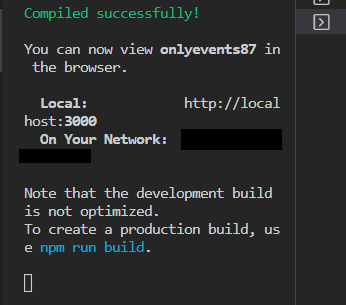

# Testing

## Code Validation

## Manual Testing

### Browser Compatibility

Browser | Outcome | Pass/Fail | 
--- | --- | --- |
Google Chrome | No appearance, responsiveness, or functionality issues. | Pass |
Safari | No appearance, responsiveness, or functionality issues. | Pass |
Mozilla Firefox | No appearance, responsiveness, or functionality issues. | Pass |
Microsoft Edge | No appearance, responsiveness, or functionality issues. | Pass |

### Device Compatibility

Device |Outcome | Pass/Fail
--- | --- | --- |
iPhone SE | No appearance, responsiveness, or functionality issues. | Pass |
iPhone XR | No appearance, responsiveness, or functionality issues. | Pass |
iPhone 12 Pro | No appearance, responsiveness, or functionality issues. | Pass |
Pixel 5 | No appearance, responsiveness, or functionality issues. | Pass |
Samsung Galaxy S8+ | No appearance, responsiveness, or functionality issues. | Pass |
Samsung Galaxy S20 Ultra |No appearance, responsiveness, or functionality issues. | Pass |
iPad Air | No appearance, responsiveness, or functionality issues. | Pass |
iPad Mini | No appearance, responsiveness, or functionality issues. | Pass |
Surface Pro 7 | No appearance, responsiveness, or functionality issues. | Pass |
SurfaceDuo | No appearance, responsiveness, or functionality issues. | Pass |
Galaxy Fold | No appearance, responsiveness, or functionality issues. | Pass |
Samsung Galaxy A51/71 | No appearance, responsiveness, or functionality issues. | Pass |
Nest Hub | No appearance, responsiveness, or functionality issues. | Pass |
Nes Hub Max | No appearance, responsiveness, or functionality issues. | Pass |

### Test Results

#### Navigation bar

Element | Expected Outcome | Pass/Fail |
--- | --- | --- |
Navbar | When the user is logged out it displays only the logo, home, sign in and sign up links. | Pass |
Navbar | When the user is logged in it displays the logo, add event, home, feeds, favorites, interested, going, sign out, and profile links. | Pass |
Navbar | When the user is the admin it displays the logo, add event, home, categories, feeds, favorites, interested, going, sign out, and profile links. | Pass |
Main Logo Link | Clicking the link redirects to the home page. | Pass |
Add event Link | Clicking the link redirects to the add event form. | Pass |
Home Link | Clicking the link redirects to the home page. | Pass |
Categories Link | Clicking the link redirects to the categories page. | Pass |
Feeds Link | Clicking the link redirects to the account home page, presenting only the events posted by the users the current user follows. | Pass |
Favorites Link | Clicking the link redirects to the home page, presenting only the events of which genres are included in the user's preferences. | Pass |
Interested link | Clicking the link redirects to the home page, presenting only the events the user showed interest in. | Pass |
Going link | Clicking the link redirects to the home page, presenting only the events the user is going to. | Pass |
Profile Link | Clicking the link redirects to the user profile page. | Pass |
Sign out link | Clicking the link redirects to the home page, logging out the user and displaying a different navbar layout. | Pass |
Sign out link |  When the user clicks Sign Out, it displays a notification with the outcome. | Pass |
Sign in Link | Clicking the link redirects to the account sign in page. | Pass |
Sign up Link | Clicking the link redirects to the account sign up page. | Pass |

#### Sign up form

Element | Expected Outcome | Pass/Fail |
--- | --- | --- |
Sign up form | If the user is not logged in, they can access the form. | Pass |
Sign up form | If the user is logged in, they can't access the form. | Pass |
Sign up form | If the user fills up the form correctly, they are redirected to the sign in form. | Pass |
Sign up form | If the user doesn't fill up the form correctly, it displays an error message under the relevant field. | Pass |
Sign up form |  When the form it's submitted, it displays a notification with the outcome. | Pass |

#### Sign in form

Element | Expected Outcome | Pass/Fail |
--- | --- | --- |
Sign in form | If the user is not logged in, they can access the form. | Pass |
Sign in form | If the user is logged in, they can't access the form. | Pass |
Sign in form | If the user fills up the form correctly, it logs them in. | Pass |
Sign in form | If the user doesn't fill up the form correctly, it displays an error message under the relevant field. | Pass |
Sign in form |  When the form it's submitted, it displays a notification with the outcome. | Pass |

#### Home Page

Element | Expected Outcome | Pass/Fail |
--- | --- | --- |
Search Bar | Typing in the search bar filters the events on the home page displaying the events of which the keyword is included in the username, title, or date. | Pass |
Add the next event Link | If the user is not logged in, it doesn't display the link. | Pass |
Add the next event Link | Clicking the link will redirect the user to the create event form. | Pass |
Event Card avatar |The avatar and the name of the event owner are displayed at the top of the card. | Pass |
Event Card avatar | Clicking the link redirects to the event owner profile. | Pass |
Event Card image | Clicking the link redirects to the event page. | Pass |
Event Card star icon | Clicking the icon increases the number displayed next to it. On the event page, the user appears in the Interested section. | Pass |
Event Card checked calendar icon | Clicking the icon increases the number displayed next to it. On the event page, the user appears in the Going section. | Pass |
Event Card comment icon | Clicking the link redirects to the event page. | Pass |
Most followed profile avatar | Clicking the avatar redirects to the avatar owner's profile page. | Pass |
Most followed profile Follow button | Clicking the button makes the style and the text to Unfollow change, increasing the number of followers of the profile clicked and the number of following of the user that clicked. | Pass |
Most followed profile Unfollow button | Clicking the button makes the style and the text to Follow change, decreasing the number of followers of the profile clicked and the number of following of the user that clicked. | Pass |

#### Event Page

Element | Expected Outcome | Pass/Fail |
--- | --- | --- |
See gallery button | Clicking on the button toggles the gallery, showing/hiding the event's photos. | Pass |
See gallery button | If the user is not logged in, the button doesn't display. | Pass |
Gallery section | If the user is not logged in and tries to access the page via URL, it displays a message requesting them to log in. | Pass |
Add a photo button | Clicking on the button redirects the user to the photo create form. | Pass |
Event dropdown menu icon | It's displayed only if the user is the event owner. | Pass |
Event dropdown menu icons | Clicking the icon displays an edit and delete icon. | Pass |
Event dropdown menu delete icon | Clicking the icon deletes the event. | Pass |
Event dropdown menu edit icon | Clicking the icon redirects the user to the event edit form. | Pass |
Add genre button | It displays only if the user is the event owner. | Pass |
Add genre button | Clicking the button toggles the form to add genres to the event. | Pass |
Genre form | The form displays all genres relative to the events category. | Pass |
Genre form | Selecting a genre and clicking "create" adds a new genre to the event. | Pass |
Genre form | Selecting a genre and clicking "create" adds a new genre to the event. | Pass |
Genre form | Selecting a genre already added and clicking "create" displays an error message. | Pass |
Genre form | Selecting a "select the event genre" option and clicking "create" displays an error message. | Pass |
Genre form |  When the form it's submitted, it displays a notification with the outcome. | Pass |
Comment create form | Typing a comment and clicking "post" adds the comment. | Pass |
Comment create form |  When the form it's submitted, it displays a notification with the outcome. | Pass |
Comments | All the event comments are displayed in chronological order, with the most recent on top. | Pass |
Comments | Users can like comments unless they are the comment owner. | Pass |
Comment dropdown menu | If the user is the comment owner, the dropdown menu is displayed. | Pass |
Comment dropdown menu | If the user clicks the dropdown it displays the edit and deletes icons. | Pass |
Comment dropdown menu | If the user clicks the delete icon, it deletes the comment. | Pass |
Comment dropdown menu | If the user clicks the edit icon, it opens the edit form with the previous comment. | Pass |
Comment edit form | If the user edits the comment and clicks "save" it updates the comment. | Pass |
Comment edit form | If the user edits the comment and clicks "cancel" it discharges the change. | Pass |
Comment edit form |  When the form it's submitted, it displays a notification with the outcome. | Pass |
Going section | It displays the profiles of the users going to the event and their count. | Pass |
Going section | If the user clicks on the going icon (checked calendar) at the bottom of the event (or event card), the going count increases. | Pass |
Going section | If the user clicks on the going icon at the bottom of the event (or event card), the user's avatar and name appear in the going section. | Pass |
Going section | If the user clicks again on the going icon at the bottom of the event (or event card), the going count decreases. | Pass |
Going section | If the user clicks again on the going icon at the bottom of the event (or event card), the user's avatar and name disappear from the going section. | Pass |
Interested section | It displays the profiles of the users interested in the event and their count. | Pass |
Interested section | If the user clicks on the interested icon (star) at the bottom of the event (or event card), the number of interested increases. | Pass |
Interested section | If the user clicks on the interested icon at the bottom of the event (or event card), the user's avatar and name appear in the interested section. | Pass |
Interested section | If the user clicks again on the interested icon at the bottom of the event (or event card), the number of interested decreases. | Pass |
Interested section | If the user clicks again on the interested icon at the bottom of the event (or event card), the user's avatar and name disappear from the going section. | Pass |

#### Event create form

Element | Expected Outcome | Pass/Fail |
--- | --- | --- |
Event create form | If the user is not logged in, they can't access the form. | Pass |
Upload image | If the user clicks on the section, it allows the user to upload an image. | Pass |
Upload image | If the user doesn't upload an image, the form can't be submitted. | Pass |
Upload image | If the user doesn't upload an image, it displays an error message. | Pass |
Event title field | If the user clicks on the section, it allows the user to type a title for the event. | Pass |
Event title field | If the user doesn't input a title, the form can't be submitted. | Pass |
Event title field | If the user doesn't input a title, it displays an error message. | Pass |
Event DateTime field | If the user clicks on the section, it allows the user to add the date and time of the event. | Pass |
Event DateTime field | If the user doesn't input a date and time, the form can't be submitted. | Pass |
Event DateTime field | If the user doesn't input a date and time, it displays an error message. | Pass |
Event category field | If the user clicks on the section, it allows the user to add the category to the event. | Pass |
Event category field | If the user doesn't select a category, the form can't be submitted. | Pass |
Event category field | If the user doesn't select a category, it displays an error message. | Pass |
Event category field | If the user selects the "select the event category" option, it displays an error message. | Pass |
Event location field | If the user clicks on the section, it allows them to type the event location. | Pass |
Event location field | If the user doesn't input the location, the form can't be submitted. | Pass |
Event title field | If the user doesn't input the location, it displays an error message. | Pass |
Event address field | If the user clicks on the section, it allows the user to type the address of the event. | Pass |
Event address field | If the user doesn't input the address, the form can't be submitted. | Pass |
Event title field | If the user doesn't input the address, it displays an error message. | Pass |
Event content field | If the user clicks on the section, it allows them to type a description of the event. | Pass |
Event content field | If the user doesn't input the content, the form can still be submitted. | Pass |
Event cancel button | If the user clicks the cancel button, it redirects the user to the previous page. | Pass |
Event create button | If the user clicks the create button, it posts the event unless error messages are displayed. | Pass |
Event create form |  When the form it's submitted, it displays a notification with the outcome. | Pass |

#### Event edit form

Element | Expected Outcome | Pass/Fail |
--- | --- | --- |
Event edit form | If the user is not the event owner, they can't access the form. | Pass |
Change | If the user clicks on the "change the image" button, it allows the user to upload a new image. | Pass |
Upload image | If the user doesn't upload an image and submits the form, the event will have the previous image. | Pass |
Event title field | If the user doesn't edit the title and submits the form, the event will have the previous title. | Pass |
Event title field | If the user deletes the previous title and doesn't input a new one, it displays an error message. | Pass |
Event DateTime field | If the user clicks on the section, it allows them to edit the date and time of the event. | Pass |
Event DateTime field | If the user doesn't edit the date and time and submits the form, the event will have the previous date and time. | Pass |
Event category field | If the user clicks on the section, it allows them to edit the event category. | Pass |
Event category field | If the user doesn't select a different category and submits the form, the event will have the previous category. | Pass |
Event category field | If the user selects the "select the event category" option, it displays an error message. | Pass |
Event category field | If the user edits the category, it deletes the event genres added to the event. | Pass |
Event category info | The info icon is displayed next to the category section. | Pass |
Event category info | If the user clicks the info icon, it displays a message. | Pass |
Event location field | If the user clicks on the section, it allows them to edit the event location. | Pass |
Event location field | If the user doesn't edit the location and submits the form, the event will have the previous location. | Pass |
Event title field | If the user deletes the previous location and doesn't input a new one, it displays an error message. | Pass |
Event address field | If the user clicks on the section, it allows them to edit the address of the event. | Pass |
Event address field | If the user doesn't edit the address and submits the form, the event will have the previous address. | Pass |
Event title field | If the user deletes the previous address and doesn't input the new address, it displays an error message. | Pass |
Event content field | If the user clicks on the section, it allows them to edit the event description. | Pass |
Event content field | If the user doesn't edit the content and submits the form, the event will have the previous address. | Pass |
Event content field | If the user deletes the content, the form can still be submitted. | Pass |
Event cancel button | If the user clicks the cancel button, it redirects the user to the previous page, discharging the changes. | Pass |
Event cancel button | If the user clicks the cancel button but has changed the category while on the edit form page, the event genres are still deleted. | Pass |
Event save button | If the user clicks the "save" button, it posts the event unless error messages are displayed. | Pass |
Event edit form |  When the form it's submitted, it displays a notification with the outcome. | Pass |

#### Photo page

Element | Expected Outcome | Pass/Fail |
--- | --- | --- |
Avatar |The avatar and the name of the photo owner are displayed at the top of the card. | Pass |
Avatar | Clicking the link redirects to the photo owner profile. | Pass |
Photo | It displays the title, the photo, and the date of when the photo was posted. | Pass |
Photo dropdown menu | If the user is the photo owner, the dropdown menu is displayed. | Pass |
Photo dropdown menu | If the user clicks the dropdown it displays the edit and deletes icons. | Pass |
Photo dropdown menu | If the user clicks the delete icon, it deletes the photo and redirect to the event. | Pass |
Photo dropdown menu | If the user clicks the edit icon, it opens the edit form with the previous photo. | Pass |
Back button | If the user clicks the button, it redirects to the previous page. | Pass |

#### Photo create form

Element | Expected Outcome | Pass/Fail |
--- | --- | --- |
Photo create form | If the user is not logged in, they can't access the form. | Pass |
Upload section | If the user clicks the "click or tap to upload an image" section, it allows them to upload an image. | Pass |
Upload section | If the user doesn't upload an image and submits the form, it will display an error message. | Pass |
Photo title | If the user clicks on the photo title field, it allows them to type the title. | Pass |
Photo title | If the user doesn't type the title and submits the form, it will display an error message. | Pass |
Create button | If the user clicks "create" and the form doesn't have errors, it will create a new photo. | Pass |
Photo create form |  When the form it's submitted, it displays a notification with the outcome. | Pass |
Cancel button | If the user clicks "cancel", it won't create a new image and close the form. | Pass |

#### Photo edit form

Element | Expected Outcome | Pass/Fail |
--- | --- | --- |
Photo edit form | If the user is not the photo owner, they can't access the form. | Pass |
Upload section | If the user clicks the "change image" section, it allows them to upload a new image. | Pass |
Upload section | If the user doesn't upload an image and submits the form, it will display the image previously uploaded. | Pass |
Photo title | If the user clicks on the photo title field, it allows them to edit the title. | Pass |
Photo title | If the user doesn't edit the title and submits the form, it will display the previous title. | Pass |
Photo title | If the user deletes the title and submits the form, it will display an error message. | Pass |
Save button | If the user clicks "save" and the form doesn't have errors, it will update the photo. | Pass |
Photo edit form |  When the form it's submitted, it displays a notification with the outcome. | Pass |
Cancel button | If the user clicks "cancel", it will discharge all changes. | Pass |

#### Profile page

Element | Expected Outcome | Pass/Fail |
--- | --- | --- |
Profile picture section | It displays the profile picture of the user. | Pass |
Edit profile button | If the user is the profile owner, it displays a button that opens a dropdown menu to edit the password, username, or profile (bio and image). | Pass |
Edit profile button | If the user is not the profile owner, the button doesn't appear. | Pass |
Photo section | If the user is not logged in, the button doesn't display. | Pass |
Photo section | If the user is not logged in and tries to access the page via URL, it displays a message requesting them to log in. | Pass |
Photo section | If the user is not logged in and tries to access the page via URL, it displays a message requesting them to log in. | Pass |
Photo section | It displays a button that links to the photos page. | Pass |
Add a preference section | If the user is the owner, this section displays a button that, when clicked, toggles the preference form. | Pass |
Preference form | If the user clicks a genre and "create", it adds a preference to the profile. | Pass |
Preference form | If the user clicks a genre already added and "create", it displays an error message. | Pass |
Preference form | If the user clicks "select your preference" and "create", it displays an error message. | Pass |
Preference form |  When the form it's submitted, it displays a notification with the outcome. | Pass |
Preference section | It displays a list of the user's favorite genres, organized by category. | Pass |
Preference section | If the user is the profile owner, it displays a bin icon next to each preference. | Pass |
Preference section | If the user clicks the bin icon, it deletes the preference. | Pass |
Main profile section | It displays the number of profile events, followers, and following. | Pass |
Main profile section | If the user creates an event, the event count increases by one. | Pass |
Main profile section | If the user deletes an event, the event count decreases by one. | Pass |
Main profile section | If the user follows a profile, the following count increases by one. | Pass |
Main profile section | If the user unfollows a profile, the following count decreases by one. | Pass |
Main profile section | If another user starts following the current user, the current user's followed count increases by one. | Pass |
Main profile section | If another user stops following the current user, the current user's followed count decreases by one. | Pass |

#### Edit profile form

Element | Expected Outcome | Pass/Fail |
--- | --- | --- |
Edit profile form | If the user is not the profile owner, they can't access the form. | Pass |
Upload section | If the user clicks the "change image" section, it allows them to upload a new image. | Pass |
Upload section | If the user doesn't upload an image and submits the form, it will display the image previously uploaded. | Pass |
Bio | If the user clicks on the bio text field, it allows them to edit the content. | Pass |
Bio | If the user doesn't edit the bio and submits the form, it will display the previous bio. | Pass |
Bio | If the user deletes the content and submits the form, it will update the profile. | Pass |
Save button | If the user clicks "save" and the form doesn't have errors, it will update the profile. | Pass |
Edit profile form |  When the form it's submitted, it displays a notification with the outcome. | Pass |
Cancel button | If the user clicks "cancel", it will discharge all changes. | Pass |

#### Edit username form

Element | Expected Outcome | Pass/Fail |
--- | --- | --- |
Edit profile form | If the user is not the profile owner, they can't access the form. | Pass |
Username field | It displays the username of the user. | Pass |
Username field | If the user edits the username with an existing one and submits the form, it will display an error message. | Pass |
Save button | If the user edits the username without errors, it updates the profile username. | Pass |
Edit profile form |  When the form it's submitted, it displays a notification with the outcome. | Pass |
Cancel button | If the user clicks "cancel", it will discharge all changes. | Pass |

#### Edit password form

Element | Expected Outcome | Pass/Fail |
--- | --- | --- |
Edit profile form | If the user is not the profile owner, they can't access the form. | Pass |
New password field | It allows the user to type a new password. | Pass |
New password field | If the user leaves this field blank, it will display an error message. | Pass |
Confirm new password field | It requires the user to retype the same password. | Pass |
Confirm new password field | If the user leaves this field blank, it will display an error message. | Pass |
Confirm new password field | If the user doesn't type the same password in both fields, it will display an error message. | Pass |
Save button | If the user types the passwords without errors, it updates the profile password. | Pass |
Edit password form |  When the form it's submitted, it displays a notification with the outcome. | Pass |
Cancel button | If the user clicks "cancel", it will discharge all changes. | Pass |

#### Categories page

Element | Expected Outcome | Pass/Fail |
--- | --- | --- |
Categories page access | The admin can access it from the navbar. | Pass |
Categories page access | If a user tries to access it through the URL, they can view the list, but can't access the forms. | Pass |
Categories page access | If a logged-out user tries to access it through the URL, they are redirected to the home page.| Pass |
Categories list | It displays the categories list and every category links to its page. | Pass |
Category create form | Clicking the input field, the admin can add a new category. | Pass |
Category create form | If the category already exists and the admin submits the form, it displays an error message. | Pass |
Category create form | If the field is blank and the admin tries to submit the form, it displays an error message. | Pass |
Category create form | If the form is filled correctly, clicking on "create will add a new category to the list". | Pass |
Category create form |  When the form it's submitted, it displays a notification with the outcome. | Pass |
Category create form | If the "cancel" button is clicked, it resets the form. | Pass |

#### Category page

Element | Expected Outcome | Pass/Fail |
--- | --- | --- |
Category page access | The admin can access it from the navbar. | Pass |
Category page access | If a user tries to access it through the URL, they can view the category and genre list but can't access the forms. | Pass |
Category page access | If a logged-out user tries to access it through the URL, they are redirected to the home page.| Pass |
Category | It displays the category name and the dropdown menu to edit and delete. | Pass |
Category edit form | It displays the category name. | Pass |
Category edit form | If the admin edits the category name by typing an existing one and submits the form, it will display an error message. | Pass |
Category edit form | If the admin deletes the category and submits the form, it will display an error message. | Pass |
Category edit form | If the admin edits the category without errors, it updates the category name. | Pass |
Category edit form | If the admin clicks "cancel", it will discharge all changes. | Pass |
Category edit form |  When the form it's submitted, it displays a notification with the outcome. | Pass |
Genres list | It displays the category genres list and their dropdown menus. | Pass |
Genre edit form | It displays the genre name. | Pass |
Genrey edit form | If the admin edits the genre name by typing an existing one and submits the form, it will display an error message. | Pass |
Genre edit form | If the admin deletes the genre and submits the form, it will display an error message. | Pass |
Genre edit form | If the admin edits the genre without errors, it updates the genre name. | Pass |
Genre edit form | If the admin clicks "cancel", it will discharge all changes. | Pass |
Genre edit form |  When the form it's submitted, it displays a notification with the outcome. | Pass |
Genre create form | By clicking the input field, the admin can add a new genre. | Pass |
Genre create form | If the genre already exists and the admin submits the form, it displays an error message. | Pass |
Genre create form | If the field is blank and the admin tries to submit the form, it displays an error message. | Pass |
Genre create form | If the form is filled correctly, clicking "create will add a new genre to the list. | Pass |
Genre create form |  When the form it's submitted, it displays a notification with the outcome. | Pass |
Genre create form | If the "cancel" button is clicked, it resets the form. | Pass |

#### Feeds page

Element | Expected Outcome | Pass/Fail |
--- | --- | --- |
Category page access | The admin can access it from the navbar. | Pass |

#### Favorites page

Element | Expected Outcome | Pass/Fail |
--- | --- | --- |
Favorites page | If the user add a preference to their profile, It displays the events that have that genre included in the event page. | Pass |
Favorites page | If the user deletes a preference form their profile, It doesn't display the events that have the deleted genre included in the event page. | Pass |

#### Interested page

Element | Expected Outcome | Pass/Fail |
--- | --- | --- |
Iterested page | If the user showed interest in an event, the event appears in the Interested page. | Pass |
Iterested page | If the user removes the interest from an event, the event doesn't appear in the Interested page. | Pass |

#### Going page

Element | Expected Outcome | Pass/Fail |
--- | --- | --- |
Going page | If the user clicks "going" (checked calendar) on an event, the event appears in the Going page. | Pass |
Going page | If the user removes the "going" from an event, the event doesn't appear in the Going page. | Pass |

## Bugs

- When testing the Interested section, I realized that by clicking on the star icon, the number of Interested was updating, but the profiles displayed weren't.
Using console logs, I realized that the problem was in the HandleUninterest function in Event.js: missing the "await" keyword resulted in inconsistent updates. Adding "await" fixed the issue.
- When testing the CreateCategoryForm, inputting an existing category name would result in a 400 error but wouldn't display the error message to the user. It was happening because in case of a duplicate, the error.response.data is an object, and to access the value it needs the key. Adding the following code fixed the issue.
{errors && errors.detail && (
   <Alert variant="warning">{errors.detail}</Alert>
)}
- When a logged-out user was trying to access a restricted area such as the photos page, even though they were redirected to the home page, it would throw the error “Can’t perform a React state update on an unmounted component”.
To fix the error I wrote an if statement to run the useEffect function only if the current user wasn't null.